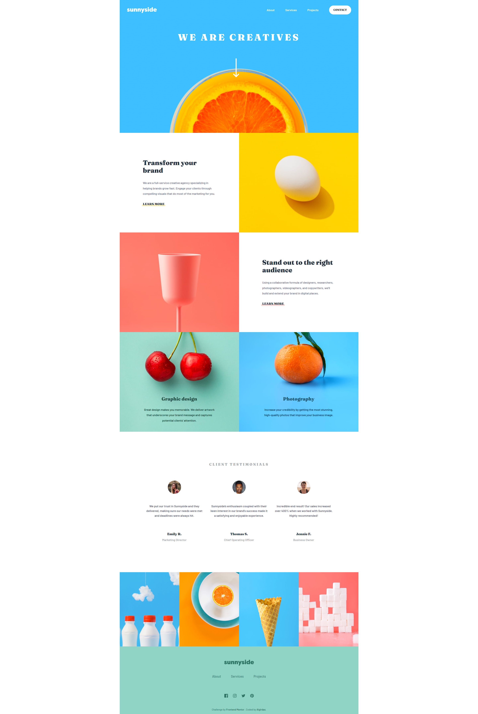
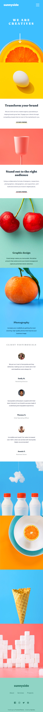

# Frontend Mentor - Sunnyside agency landing page solution

This is a solution to the [Sunnyside agency landing page challenge on Frontend Mentor](https://www.frontendmentor.io/challenges/sunnyside-agency-landing-page-7yVs3B6ef). Frontend Mentor challenges help you improve your coding skills by building realistic projects.

## Table of contents

- [Overview](#overview)
  - [The challenge](#the-challenge)
  - [Screenshot](#screenshot)
  - [Links](#links)
- [My process](#my-process)
  - [Built with](#built-with)
  - [What I learned](#what-i-learned)
  - [Useful resources](#useful-resources)
- [Author](#author)


## Overview

### The challenge

Users should be able to:

- View the optimal layout for the site depending on their device's screen size
- See hover states for all interactive elements on the page

### Screenshot




### Links

- Solution URL: (https://github.com/AlgirdasU/Sunnyside-agency-landing-page-main)
- Live Site URL: (https://deft-conkies-58b436.netlify.app/)

## My process

### Built with

- Semantic HTML5 markup
- CSS custom properties
- Flexbox
- CSS Grid
- SCSS
- JS


### What I learned

How to use CSS clip-path, I put link below where you can try to practice. It helped me create a background of a specific shape for mobile menu. I've used minimal animation.
How to smoothly move to the next section by clicking white arrow. This code you can find in to JS file or just look the code below. Also I added a scale effect on to the images.:) 

```html
<a href="#section-2" class="hero__arrow-down-box">
 </a>
```

```css
```

```js
const arrowDown = document.querySelector(".hero__arrow-down-box");
const section2 = document.querySelector("#section-2");

arrowDown.addEventListener("click", function (e) {
  e.preventDefault();
  section2.scrollIntoView({ behavior: "smooth" });
});
```

### Useful resources

- (https://bennettfeely.com/clippy/) - This helped me create clip-path for mobile menu.
- (https://www.udemy.com/course/advanced-css-and-sass/) - If you want to learn CSS, SCSS. 

## Author

- Website - [Algirdas](https://github.com/AlgirdasU/Sunnyside-agency-landing-page-main)
- Frontend Mentor - [@AlgirdasU](https://www.frontendmentor.io/profile/AlgirdasU)
- Twitter - [@AlgirdasDdd](https://twitter.com/algirdasddd)

